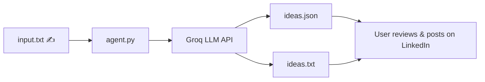

# LinkedIn Post Ideation Agent 🚀

> An AI-powered CLI agent that generates skimmable, hook-driven LinkedIn post ideas for busy professionals.

---


---

## 📚 Table of Contents

1. [Project Overview](#-project-overview)
2. [Problem Statement](#-problem-statement)
3. [Key Features](#-key-features)
4. [Tech Stack](#-tech-stack)
5. [System Architecture / Workflow](#-system-architecture--workflow)
6. [Installation Guide](#-installation-guide)
7. [Usage Guide](#-usage-guide)
8. [Project Folder Structure](#-project-folder-structure)
9. [API Documentation](#-api-documentation)
10. [Dataset Information](#-dataset-information)
11. [Screenshots / Demo](#-screenshots--demo)
12. [Future Enhancements](#-future-enhancements)
13. [Contribution Guidelines](#-contribution-guidelines)
14. [License](#-license)
15. [Author](#-author)

---

## 📌 Project Overview

**LinkedIn Post Ideation Agent** is a command-line tool that uses the **Groq LLM API** to generate high-quality, professional LinkedIn post ideas from a simple text prompt.

You provide a topic, audience, or angle in `input.txt`, and the agent:
- Calls Groq's chat completion API with a carefully crafted system prompt.
- Generates **5 distinct, hook-driven LinkedIn post ideas**.
- Saves them both as a **structured JSON file** (`ideas.json`) and a **human-readable text file** (`ideas.txt`).

This makes it easy for content creators, founders, and professionals to consistently publish engaging content without starting from a blank page. ✨

---

## 🧩 Problem Statement

Writing LinkedIn posts regularly is challenging because:
- Coming up with **fresh ideas** every day is time-consuming.
- Many posts end up being **generic or low-engagement**.
- Professionals often lack time to **brainstorm structured content**.

This project solves that by turning a simple topic description into **ready-to-use LinkedIn post concepts** with:
- A strong **title**
- A scroll-stopping **hook**
- A clear **core message**
- A discussion-oriented **CTA**
- Relevant **hashtags**

---

## 🌟 Key Features

- ✅ Generates **5 unique LinkedIn post ideas** per run.
- 🎯 Optimized for **professional, non-generic** content.
- 🧠 Uses a **system prompt** tailored for LinkedIn-style writing.
- 📦 Outputs both **JSON** (`ideas.json`) and **formatted text** (`ideas.txt`).
- 📝 Simple input via `input.txt` — just describe your topic.
- 🔁 Deterministic enough for consistency, but still creative (configurable temperature).

---

## 🛠 Tech Stack

- **Language:** Python 3.10+
- **LLM Provider:** Groq (`llama-3.3-70b-versatile` model)
- **Libraries:**
  - `groq` – Groq API client
  - `python-dotenv` – Load environment variables from `.env`
  - Python standard library: `json`, `os`, `datetime`
- **Environment:** `.env` file for API key management

---

## 🧱 System Architecture / Workflow

High-level workflow:

1. **Input**: User writes a topic/brief into `input.txt`.
2. **Agent** (`agent.py`):
   - Loads environment variables from `.env`.
   - Creates a Groq client using `GROQ_API_KEY`.
   - Sends a system + user prompt to the `llama-3.3-70b-versatile` model.
3. **Model Response**: Returns JSON following the schema:
   ```json
   {
     "ideas": [
       {
         "title": "",
         "hook": "",
         "core_message": "",
         "cta": "",
         "hashtags": []
       }
     ]
   }
   ```
4. **Output Processing**:
   - Writes raw data to `ideas.json`.
   - Formats a readable report to `ideas.txt` with headings and numbered ideas.
5. **User**: Opens `ideas.txt` or `ideas.json` and selects/refines a post.

You can visualize it as:



---

## 🧩 Installation Guide

> Prerequisites: Python 3.10+ and a Groq API key.

1. **Clone or download** this project into a local folder.
2. **Navigate** into the project directory:
   ```bash
   cd "Day12"
   ```
3. (Optional but recommended) **Create a virtual environment**:
   ```bash
   python -m venv .venv
   .venv\Scripts\activate  # Windows
   ```
4. **Install dependencies**:
   ```bash
   pip install groq python-dotenv
   ```
5. **Configure environment variables**:
   - Create a file named `.env` in the project root.
   - Add your Groq API key:
     ```env
     GROQ_API_KEY=your_groq_api_key_here
     ```

You're now ready to generate LinkedIn post ideas. ✅

---

## ▶️ Usage Guide

1. **Edit the prompt input**:
   - Open `input.txt` and write a brief description of the content you want, for example:
     ```text
     Topic: AI tools for junior software engineers.
     Audience: early-career developers on LinkedIn.
     Angle: practical tips and real-world examples.
     Goal: start conversations and attract profile visits.
     ```

2. **Run the agent** from the project directory:
   ```bash
   python agent.py
   ```

3. **View the outputs**:
   - `ideas.json` – structured machine-readable ideas.
   - `ideas.txt` – human-friendly, formatted list of ideas.

4. **Use an idea on LinkedIn**:
   - Pick a title + hook you like.
   - Expand the core message into a full post.
   - Keep the CTA and hashtags as suggested or adjust them.

### Sample Output Snippet (ideas.txt)

```text
LinkedIn Post Ideas (2026-03-15)
=============================================

1. Stop Treating AI as Magic — Start Treating It as a Teammate
   Hook: Most junior devs think AI will replace them. The reality? It can be their unfair advantage.
   Core Message: Share 3 concrete ways junior engineers can use AI tools for code reviews, debugging, and learning faster.
   CTA: "How are you using AI in your daily dev workflow?"
   Hashtags: #SoftwareEngineering #AIForDevs #CareerGrowth
```

---

## 📁 Project Folder Structure

```bash
Day12/
├── agent.py        # Main CLI agent that orchestrates input, LLM call, and outputs
├── input.txt       # User-provided prompt/topic for idea generation
├── ideas.json      # Generated LinkedIn post ideas in JSON format
├── ideas.txt       # Human-readable report of LinkedIn post ideas
├── .env            # Environment variables (GROQ_API_KEY)
└── README.md       # Project documentation
```

---

## 🌐 API Documentation

This project does **not** expose its own HTTP API. Instead, it consumes the **Groq Chat Completions API** via the `groq` Python client.

### Groq Chat Completion Call (high level)

- **Model:** `llama-3.3-70b-versatile`
- **Endpoint:** `client.chat.completions.create(...)` (Python SDK)
- **Messages:**
  - `system`: instructions for the LinkedIn Post Ideation Agent.
  - `user`: contents of `input.txt`.
- **Response:** JSON content matching the schema in the system prompt.

If you plan to wrap this tool in a web service later (e.g., FastAPI/Flask), you can expose an endpoint that:
- Accepts a JSON body `{ "prompt": "..." }`.
- Forwards the prompt to `generate_ideas()`.
- Returns the generated `ideas` array.

---

## 📊 Dataset Information

This is **not** a dataset- or ML-training-focused project.

- No custom datasets are stored or used.
- The model is a **hosted LLM (Groq)** accessed via API.
- All prompts are **user-provided** at runtime in `input.txt`.

If you later decide to log prompts/outputs for analysis, document your storage and privacy practices here. 📁

---

## 🚀 Future Enhancements

- [ ] Add a simple **web UI** for non-technical users.
- [ ] Allow configuration of **number of ideas** and **tone**.
- [ ] Support **multiple output formats** (Markdown, HTML, CSV).
- [ ] Add an option to **regenerate** or refine a specific idea.
- [ ] Include **rate limiting / usage tracking** for team usage.

---

## 🤝 Contribution Guidelines

Contributions, issues, and feature requests are welcome! 💡

1. **Fork** the repository.
2. Create a new branch:
   ```bash
   git checkout -b feature/your-feature-name
   ```
3. Make your changes in a focused, well-documented way.
4. Run and test the agent locally.
5. **Commit** your changes with a clear message and push the branch.
6. Open a **Pull Request**, describing:
   - What you changed
   - Why it improves the project

Please keep the coding style consistent with the existing `agent.py` file.

---

## 📄 License

This project is licensed under the **MIT License**.

You are free to use, modify, and distribute this project, provided that the original license is included.

---

## 👩‍💻 Author

**Anya Sree**  
- GitHub: [Sree-8639](https://github.com/Sree-8639)  
- Email: [23A81A6193@sves.org.in](mailto:23A81A6193@sves.org.in)

If you use this project to boost your LinkedIn content game, feel free to tag the author and share your results! 💬
