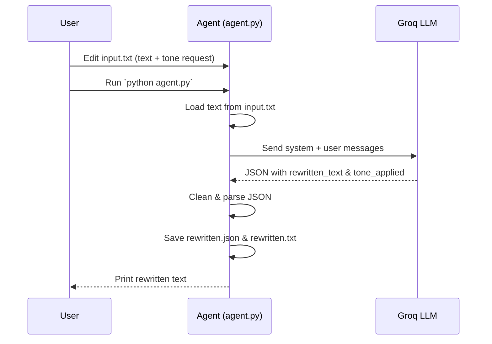

# Tone Rewriting Agent ✨

> Smart text tone rewriter powered by Groq LLM — rewrite any text into a new tone while preserving its original meaning.

---

[](https://www.python.org/)
[](#license-)
[](#contribution-guidelines-)

---

## 📚 Table of Contents

1. [Project Overview](#-project-overview)
2. [Problem Statement](#-problem-statement)
3. [Key Features](#-key-features)
4. [Tech Stack](#-tech-stack)
5. [System Architecture / Workflow](#-system-architecture--workflow)
6. [Installation Guide](#-installation-guide)
7. [Usage Guide](#-usage-guide)
8. [Project Folder Structure](#-project-folder-structure)
9. [API Documentation](#-api-documentation)
10. [Dataset Information](#-dataset-information)
11. [Screenshots / Demo](#-screenshots--demo)
12. [Future Enhancements](#-future-enhancements)
13. [Contribution Guidelines](#-contribution-guidelines)
14. [License](#-license-)
15. [Author](#-author)

---

## 🧩 Project Overview

**Tone Rewriting Agent** is a lightweight Python tool that rewrites text into a desired tone using the Groq LLM API (model: `llama-3.3-70b-versatile`).

You provide raw text and tone instructions (for example: "Rewrite this email in a polite, professional tone"), and the agent:

- Sends the request to Groq with a strict system prompt.
- Ensures the meaning is preserved while the tone is changed.
- Outputs both machine-readable JSON and a human-readable text file.

This makes it ideal for rewriting emails, documentation, reports, and any other professional communication.

---

## 🚨 Problem Statement

Writing with the right tone is hard and time-consuming, especially when you need to:

- Adjust language for different audiences (managers, clients, teammates).
- Rewrite messages to be more formal, polite, assertive, or neutral.
- Preserve the **original meaning** while improving clarity and tone.

The **Tone Rewriting Agent** solves this by automating tone transformation while enforcing strict rules around content fidelity.

---

## 🌟 Key Features

- ✏️ **Tone-controlled rewriting** — Rewrite any text to a desired tone (formal, friendly, assertive, etc.).
- 🧠 **LLM-powered** — Uses Groq's `llama-3.3-70b-versatile` chat completion model.
- 🔒 **Meaning preservation** — System prompt enforces no additions, deletions, or exaggerations.
- 📦 **Structured output** — Saves results as:
  - `rewritten.json` (JSON with `rewritten_text` and `tone_applied`).
  - `rewritten.txt` (readable text file with a timestamp header).
- 🧾 **Simple CLI workflow** — Edit an input file, run one Python script, and get the rewritten text instantly.

---

## 🛠 Tech Stack

- **Language:** Python 3.10+
- **LLM Provider:** Groq
  - Model: `llama-3.3-70b-versatile`
- **Libraries / Tools:**
  - `groq` – Groq Python SDK
  - `python-dotenv` – for loading secrets from `.env`
  - `json`, `os`, `datetime` – Python standard library modules

---

## 🔄 System Architecture / Workflow

High-level workflow:

1. 📝 **Input loading**
   - Reads the raw text from `input.txt`.

2. 🧩 **Prompting & LLM call**
   - Sends a `system` message with strict tone-rewriting rules.
   - Sends the user text (including tone instructions) as a `user` message.
   - Calls the Groq Chat Completions API with `llama-3.3-70b-versatile`.

3. 🧼 **Response cleanup & parsing**
   - Strips Markdown code fences if the model returns formatted JSON.
   - Parses the cleaned string into a JSON object with:
     - `rewritten_text`
     - `tone_applied`

4. 💾 **Output persistence**
   - Writes `rewritten.json` containing the full JSON.
   - Writes `rewritten.txt` containing a timestamp header and the rewritten text.

5. 🖥 **CLI output**
   - Prints a success message and the rewritten text to the terminal.

(Optional) Example sequence diagram using Mermaid:



---

## 🧷 Installation Guide

> ✅ Prerequisites: Python 3.10+ and a Groq API key.

1. **Clone the repository**

```bash
git clone https://github.com/Sree-8639/tone-rewriting-agent.git
cd tone-rewriting-agent
```

2. **(Optional) Create and activate a virtual environment**

```bash
python -m venv .venv
.venv\Scripts\activate  # On Windows
# source .venv/bin/activate  # On macOS / Linux
```

3. **Install dependencies**

You can either install packages directly:

```bash
pip install groq python-dotenv
```

Or, if you add a `requirements.txt` file later, use:

```bash
pip install -r requirements.txt
```

4. **Configure environment variables**

Create a `.env` file in the project root with your Groq API key:

```env
GROQ_API_KEY=your_groq_api_key_here
```

---

## 🚀 Usage Guide

1. **Prepare your input**

Edit `input.txt` and include both:

- The **text** you want to rewrite.
- A clear **tone instruction**.

Example `input.txt`:

```text
Rewrite the following email in a polite, professional tone:

Hey,

You still haven\'t finished the report and it\'s causing issues for the team.

Thanks.
```

2. **Run the agent**

From the project root, run:

```bash
python agent.py
```

3. **Inspect the outputs**

- `rewritten.json` — structured JSON output from the model.
- `rewritten.txt` — human-readable text file including the rewritten version and a date header.

4. **Example output snippet** (illustrative)

```json
{
  "rewritten_text": "I would appreciate it if this task could be completed by tomorrow, as the current delay is resulting in some difficulties.",
  "tone_applied": "polite, professional"
}
```

---

## 📁 Project Folder Structure

```bash
.
├── agent.py          # Main tone rewriting script
├── input.txt         # Raw input text + tone instructions
├── rewritten.json    # JSON output from the model
├── rewritten.txt     # Human-readable rewritten text with date header
├── .env              # Contains GROQ_API_KEY (not committed)
└── README.md         # Project documentation
```

You can extend this structure with folders like `assets/` (for screenshots) or `configs/` as the project grows.

---

## 📡 API Documentation

This project itself does **not** expose an HTTP API; it is a CLI wrapper around the **Groq Chat Completions** API via the `groq` Python SDK.

### Internal LLM Call

- **Provider:** Groq
- **Model:** `llama-3.3-70b-versatile`
- **Interface:** `client.chat.completions.create(...)`

Pseudo-code of the call:

```python
response = client.chat.completions.create(
    model="llama-3.3-70b-versatile",
    messages=[
        {"role": "system", "content": SYSTEM_PROMPT},
        {"role": "user", "content": text}
    ],
    temperature=0.25,
)
```

The model is instructed (via `SYSTEM_PROMPT`) to:

- Rewrite the text to match the requested tone.
- Preserve the original meaning exactly.
- Avoid adding/removing information or exaggerating emotion.
- Return **only valid JSON** with the schema:

```json
{
  "rewritten_text": "...",
  "tone_applied": "..."
}
```

---

## 📊 Dataset Information

This is **not** an ML training project and does **not** use a dataset.

- All rewriting is performed by a hosted LLM (Groq) at inference time.
- No user data is stored by this project other than what you keep locally in your input/output files.

If you later add fine-tuning or dataset-based evaluation, you can document the dataset details here.

---

## 🔮 Future Enhancements

Some ideas to extend this project:

- 🌐 **Web UI** using Flask/FastAPI + a simple frontend.
- 🧪 **Batch processing** of multiple files or texts in one run.
- 🎯 **Preset tone profiles** (e.g., "Corporate", "Academic", "Casual").
- 🌍 **Multi-language support** for non-English content.
- 📊 **Quality checks** (e.g., length comparison, sentiment analysis before/after).
- 🧵 **Command-line arguments** for specifying input/output paths and tone directly.

---

## 🤝 Contribution Guidelines

Contributions are very welcome! To contribute:

1. **Fork** the repository on GitHub.
2. **Create a feature branch**:

   ```bash
   git checkout -b feature/your-feature-name
   ```

3. **Make your changes**
   - Keep the coding style consistent.
   - Add or update documentation where appropriate.

4. **Test your changes** locally.

5. **Commit and push** your branch:

   ```bash
   git commit -m "Add awesome new feature"
   git push origin feature/your-feature-name
   ```

6. **Open a Pull Request** with a clear title and description.

---

## 📜 License 🧾

This project is licensed under the **MIT License**.

You are free to use, modify, and distribute this project for personal or commercial purposes, subject to the terms of the MIT license.

> If you prefer a different license (e.g., Apache-2.0 or no license), update this section and add the corresponding `LICENSE` file.

---

## 👤 Author

**Anya Sree**  
- 💻 GitHub: [Sree-8639](https://github.com/Sree-8639)  
- 📧 Email: [23A81A6193@sves.org.in](mailto:23A81A6193@sves.org.in)

If you find this project useful, consider ⭐ starring the repository on GitHub!
