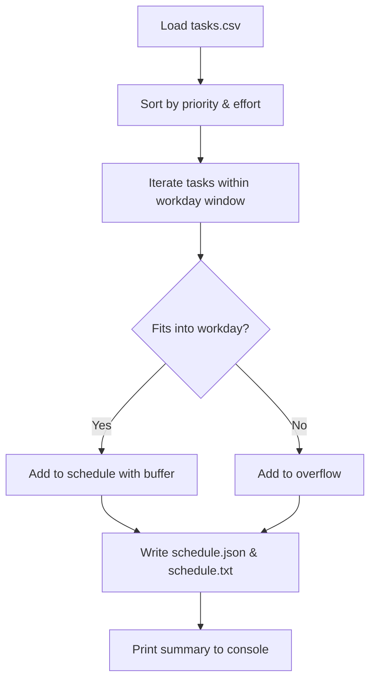

# Time-blocking Planner Agent ⏰

> Automatically turn your task list into a prioritized, time-blocked daily schedule.


[](https://www.python.org/)
[](LICENSE)
[](#contribution-guidelines)

---

## 📚 Table of Contents

1. [Project Overview](#-project-overview)
2. [Problem Statement](#-problem-statement)
3. [Features](#-features)
4. [Tech Stack](#-tech-stack)
5. [Architecture / Workflow](#-architecture--workflow)
6. [Installation Guide](#-installation-guide)
7. [Usage Guide](#-usage-guide)
8. [Project Folder Structure](#-project-folder-structure)
9. [API Documentation](#-api-documentation)
10. [Screenshots / Demo](#-screenshots--demo)
11. [Future Enhancements](#-future-enhancements)
12. [Contribution Guidelines](#-contribution-guidelines)
13. [License](#-license)
14. [Author](#-author)

---

## 🧾 Project Overview

The **Time-blocking Planner Agent** is a lightweight Python-based CLI tool that converts a list of tasks into a **time-blocked daily schedule**.

You provide a CSV file of tasks with estimated effort and priority, and the agent:

- Sorts tasks by priority and effort.
- Packs them into a configurable workday window.
- Inserts buffer time between tasks.
- Outputs both a **human-readable text schedule** and a **machine-readable JSON schedule**.

This is ideal for students, developers, and professionals who want a simple, local, and fast way to structure their day without relying on heavy calendar apps.

---

## ❓ Problem Statement

Manually planning a focused workday is time-consuming and often inconsistent:

- Tasks are not always prioritized effectively.
- Time estimates and available hours are not reconciled.
- Overflow work is not clearly identified.

The **Time-blocking Planner Agent** automates this process by:

- Respecting a fixed workday (default: `09:00`–`17:00`).
- Prioritizing tasks by urgency and importance.
- Highlighting tasks that **do not fit** into the day (overflow).

This helps users create a realistic daily plan and avoid overcommitting.

---

## ✨ Features

- ✅ **Priority-aware scheduling**: Orders tasks by priority (`high`, `medium`, `low`) and then by effort.
- ✅ **Fixed workday window**: Schedules tasks between a configurable start and end time (defaults to 09:00–17:00).
- ✅ **Automatic buffer time**: Adds a short buffer (default: 10 minutes) between consecutive tasks.
- ✅ **Overflow detection**: Tasks that do not fit into the workday are listed separately as *Unscheduled Tasks*.
- ✅ **Multiple output formats**:
  - `schedule.txt` – human-friendly schedule.
  - `schedule.json` – structured data for further automation.
- ✅ **Simple configuration**: Uses only the Python standard library; no external dependencies.

---

## 🛠 Tech Stack

- **Language**: Python 3.10+
- **Standard Library Modules**:
  - `csv` – to read tasks from a CSV file.
  - `json` – to export structured schedule data.
  - `datetime` – to perform time arithmetic for blocks and buffers.

No database or external services are required.

---

## 🧱 Architecture / Workflow

High-level workflow:

1. **Input**: Read tasks from `tasks.csv`.
2. **Preprocessing**: Normalize priority, parse effort, and sort tasks.
3. **Scheduling Engine**:
   - Start from `WORKDAY_START`.
   - For each task, add a time block if it fits before `WORKDAY_END`.
   - Insert a buffer after each scheduled task.
   - Move tasks that do not fit into an **overflow list**.
4. **Outputs**:
   - Write a JSON representation to `schedule.json`.
   - Write a formatted text schedule to `schedule.txt`.
5. **CLI Summary**: Print the number of scheduled blocks to the console.

### 🔄 Simple Flow Diagram



---

## 💻 Installation Guide

1. **Prerequisites**
   - Python **3.10+** installed on your system.
   - Git (optional, for cloning the repository).

2. **Clone the repository**

   ```bash
   git clone https://github.com/Sree-8639/time-blocking-planner-agent.git
   cd time-blocking-planner-agent
   ```

   > If you downloaded the project as a ZIP, simply extract it and open the folder in your terminal or VS Code.

3. **(Optional) Create a virtual environment**

   ```bash
   python -m venv .venv
   .venv\Scripts\activate  # On Windows
   # source .venv/bin/activate  # On macOS/Linux
   ```

4. **Dependencies**

   - This project uses **only the Python standard library** — no extra packages to install.

---

## 🚀 Usage Guide

1. **Prepare your tasks file** (`tasks.csv` in the project root):

   The CSV file must have the following header columns:

   ```csv
   task,effort_minutes,priority
   "Deep work on project",120,high
   "Email cleanup",30,low
   "Team sync",45,medium
   ```

   - `task`: Short description of the task.
   - `effort_minutes`: Estimated duration of the task in minutes.
   - `priority`: One of `high`, `medium`, or `low` (case-insensitive).

2. **Run the agent**

   From the project root directory:

   ```bash
   python agent.py
   ```

3. **Review the outputs**

   - `schedule.txt` – formatted human-readable schedule.
   - `schedule.json` – structured output, e.g.: 

     ```json
     {
       "schedule": [
         {"task": "Deep work on project", "start": "09:00", "end": "11:00"},
         {"task": "Team sync", "start": "11:10", "end": "11:55"}
       ],
       "overflow": [
         {"task": "Email cleanup", "effort": 30, "priority": "low"}
       ]
     }
     ```

4. **Console output**

   After running, you will see something like:

   ```text
   Time-blocking plan generated.
   Scheduled blocks: 6
   ```

---

## 📂 Project Folder Structure

```text
.
├── agent.py          # Main scheduling logic and CLI entrypoint
├── tasks.csv         # Input tasks list (editable by user)
├── schedule.json     # Generated structured schedule output
├── schedule.txt      # Generated human-readable daily schedule
└── README.md         # Project documentation
```

> Note: The screenshot referenced above is expected at `assets/time-blocking-planner.png`. Create this folder and place the image there if it does not already exist.

---

## 📡 API Documentation

This project is currently a **CLI tool only** and does **not expose any HTTP API endpoints**.

If you plan to build an API on top of this logic, you can:

- Wrap the `generate_schedule(tasks)` function from `agent.py` in a web framework (e.g., FastAPI, Flask).
- Accept JSON or CSV payloads and return the generated schedule.

---

## 🔮 Future Enhancements

Some potential improvements and extensions:

- 📅 Export schedule directly to Google Calendar or Outlook.
- 🌙 Support multiple days and recurring tasks.
- ⚙️ Make workday hours and buffer time configurable via a config file or CLI flags.
- 🧠 Use simple heuristics or ML to refine task ordering based on historical completion.
- 🌐 Add a small web UI or REST API for remote usage.

---

## 🤝 Contribution Guidelines

Contributions are welcome! To contribute:

1. **Fork** the repository on GitHub.
2. **Create a feature branch**:

   ```bash
   git checkout -b feature/my-improvement
   ```

3. **Make your changes** with clear commit messages.
4. **Test** the script locally (`python agent.py` with a sample `tasks.csv`).
5. **Open a Pull Request** describing:
   - What you changed.
   - Why the change is useful.
   - Any breaking changes or new usage notes.

Please keep the code style consistent with the existing Python script (standard library only unless a dependency is truly necessary).

---

## 📄 License

This project is licensed under the **MIT License**.

You are free to use, modify, and distribute this software, provided that the original license is included with any substantial portions of the software.

---

## 👤 Author

- **Name**: Anya Sree
- **GitHub**: [@Sree-8639](https://github.com/Sree-8639)
- **Email**: 23A81A6193@sves.org.in

If you find this project useful, consider giving it a ⭐ on GitHub!